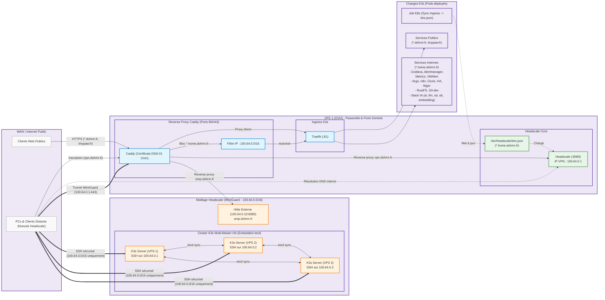

```mermaid
flowchart LR
    %% Styles & Classes
    classDef public fill:#f9f9f9,stroke:#999,stroke-width:1px;
    classDef edge fill:#e1f5fe,stroke:#0288d1,stroke-width:2px;
    classDef vpn fill:#e8f5e9,stroke:#388e3c,stroke-width:2px;
    classDef node fill:#fff3e0,stroke:#f57c00,stroke-width:2px;
    classDef cluster fill:#ede7f6,stroke:#512da8,stroke-width:2px;

    %% Zone Publique
    subgraph Public["WAN / Internet Public"]
        ClientPublic["Clients Web Publics"]
        ClientVPN["PCs & Clients Distants (Noeuds Headscale)"]
    end

    %% VPS1 (Edge / Ingress / Headscale)
    subgraph VPS1_Box["VPS 1 (OVH) - Passerelle & Point d'entrée"]
        subgraph CaddyLayer["Reverse Proxy Caddy (Ports 80/443)"]
            Caddy["Caddy (Certificats DNS-01 OVH)"]
            ACL["Filtre IP : 100.64.0.0/16"]
        end

        subgraph IngressK3s["Ingress K3s"]
            Traefik["Traefik (:81)"]
        end

        subgraph VPNServer["Headscale Core"]
            Headscale["Headscale (:8080)<br/>IP VPN : 100.64.0.1"]
            DNSFile["/etc/headscale/dns.json<br/>(*.home.dohrm.fr)"]
        end
    end

    %% Réseau Privé
    subgraph Mesh["Maillage Headscale (WireGuard - 100.64.0.0/16)"]
        subgraph ClusterK3s["Cluster K3s Multi-Master HA (Embedded etcd)"]
            K3s_VPS1["K3s Server (VPS 1)<br/>SSH sur 100.64.0.1"]
            K3s_VPS2["K3s Server (VPS 2)<br/>SSH sur 100.64.0.2"]
            K3s_VPS3["K3s Server (VPS 3)<br/>SSH sur 100.64.0.3"]
            
            K3s_VPS1 <-->|"etcd sync"| K3s_VPS2
            K3s_VPS2 <-->|"etcd sync"| K3s_VPS3
            K3s_VPS3 <-->|"etcd sync"| K3s_VPS1
        end
        NodeAMP["Hôte Externe (100.64.0.10:8080)<br/>amp.dohrm.fr"]
    end

    %% Pods et Jobs
    subgraph K8sWorkloads["Charges K3s (Pods déployés)"]
        JobSync["Job K8s (Sync Ingress -> dns.json)"]
        ServicesPublics["Services Publics<br/>(*.dohrm.fr, tinypaw.fr)"]
        ServicesPrivés["Services Internes (*.home.dohrm.fr)<br/>- Grafana, Alertmanager, Metrics, VMAlert<br/>- Argo, n8n, Ozzie, HA, Wger<br/>- RustFS, S3-dev<br/>- Stack IA (ai, llm, sd, stt, embedding)"]
    end

    %% Flux WAN
    ClientPublic -->|"HTTPS (*.dohrm.fr, tinypaw.fr)"| Caddy
    ClientVPN -->|"Inscription (vpn.dohrm.fr)"| Caddy
    ClientVPN -.->|"Résolution DNS interne"| Headscale
    ClientVPN ==>|"Tunnel WireGuard (100.64.0.1:443)"| Caddy

    %% Routage Caddy
    Caddy -->|"Proxy direct"| Traefik
    Caddy -->|"Bloc *.home.dohrm.fr"| ACL
    ACL -->|"Autorisé"| Traefik
    Caddy -->|"Reverse proxy vpn.dohrm.fr"| Headscale
    Caddy -->|"Reverse proxy amp.dohrm.fr"| NodeAMP

    %% Distribution K3s
    Traefik --> ServicesPublics
    Traefik --> ServicesPrivés
    JobSync -.->|"Met à jour"| DNSFile
    DNSFile -.->|"Charge"| Headscale

    %% Gestion SSH
    ClientVPN ==>|"SSH sécurisé (100.64.0.0/16 uniquement)"| K3s_VPS1
    ClientVPN ==>|"SSH sécurisé (100.64.0.0/16 uniquement)"| K3s_VPS2
    ClientVPN ==>|"SSH sécurisé (100.64.0.0/16 uniquement)"| K3s_VPS3

    %% Application des styles
    class ClientPublic,ClientVPN public;
    class Caddy,ACL,Traefik edge;
    class Headscale,DNSFile vpn;
    class K3s_VPS1,K3s_VPS2,K3s_VPS3,NodeAMP node;
    class ServicesPublics,ServicesPrivés,JobSync cluster;
```
